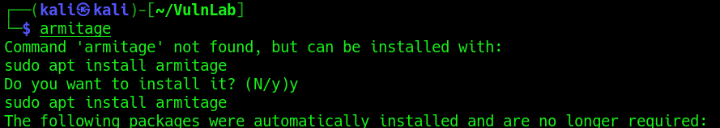
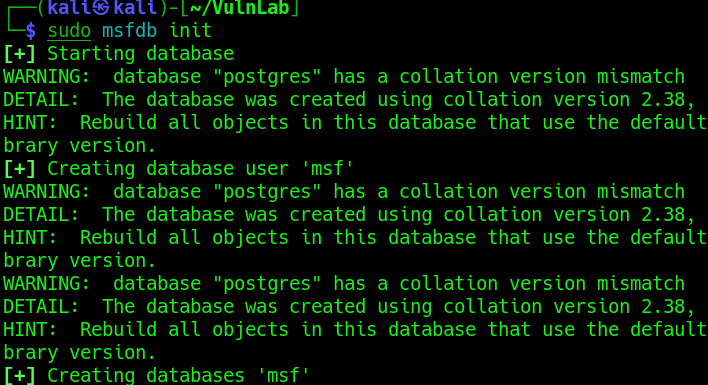
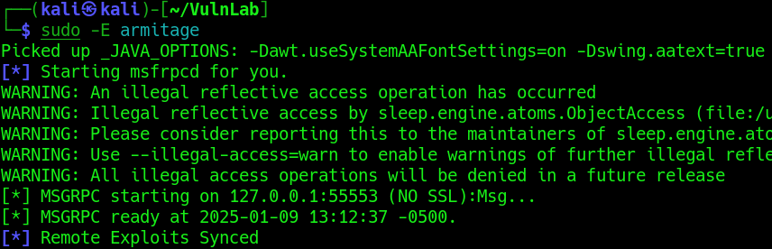
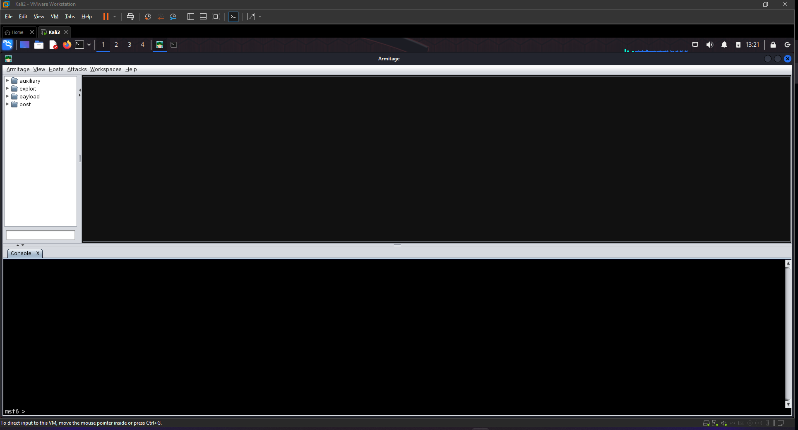

<h1>Using Armitage</h1>

<h2>Description</h2>
Armitage is an extension of the Metasploit Framework - it adds a Graphical user interface and is written in Java, and is very similar to Cobalt Strike.
<br />


<h2>Languages and Utilities Used</h2>
 
- <b>Kali Linux</b>
- <b>Armitage</b>

<h2>Environments Used </h2>

- <b>Windows 10</b>

<h3>Installation</h3>
  Armitage can be installed using the following command <i>apt install armitage</i><br />
<p align="center">
  
</p>
<br />
<h3>Running Armitage</h3>
<b>Step 1: Initialize MsfDB</b><br />
After installing Armitage, if you are on Kali Linux ensure that your Metasploit Database has been initialized with the following command: <i>sudo msfdb init</i>. <br />
<p align="center">
  
</p>
<br />
<b>Step 2: Run Armitage</b>
Once that is done we can run Armitage:<br />
<p align="center">
  
</p>
<br />
Then the GUI will open:
<p align="center">
  
</p>
 <br />


 
<!--
 ```diff
- text in red
+ text in green
! text in orange
# text in gray
@@ text in purple (and bold)@@
```
--!>
